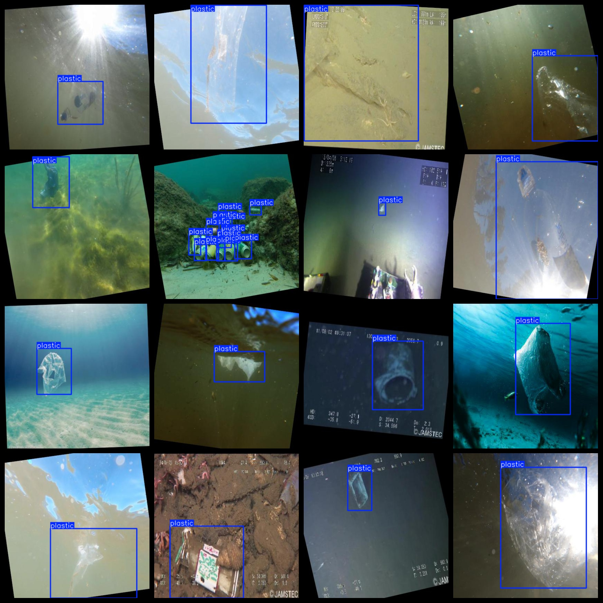
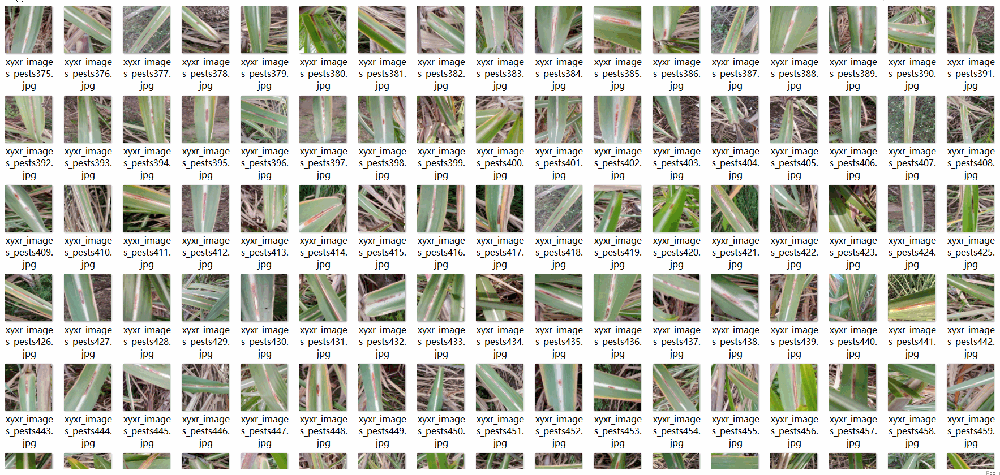

# Marine Plastic Garbage Detection Dataset: 6320 Images in VOC+YOLO Format

The Marine Plastic Garbage Detection Dataset consists of 6320 images in the VOC+YOLO format.

Dataset Format: Pascal VOC format plus YOLO format (excluding the split path in the txt file, only including jpg images along with their corresponding VOC format xml files and YOLO format txt files).

Number of Images (JPG Files): 6320

Number of Annotations (XML Files): 6320

Number of Annotations (TXT Files): 6320

Number of Annotation Categories: 1

GitHub repository: datasets_sl

Annotation Category Name: ["plastic"]

Number of bounding boxes for each category:

- plastic bounding box count = 8910
- Total bounding box count = 8910
- Number of images occupied by each category:
- plastic occupied images count = 6320

Image resolution: 416x416

Using an annotation tool: labelImg

Dataset enhancement status: Yes (m05)

Annotation rules: Draw a bounding box around the category.

Important Note: The dataset does not include any partitioning for training, validation, or testing sets; you will need to do that yourself.

Special Remark: This dataset does not guarantee the accuracy of the trained models or weight files.

## Images

---

Here is a pay link on Stripe (https://buy.stripe.com/3cs8yP7sY87d0vu9AB). Please contact me lonlonago@foxmail.com after funding $89, and I will send you a complete data files, thank you!

